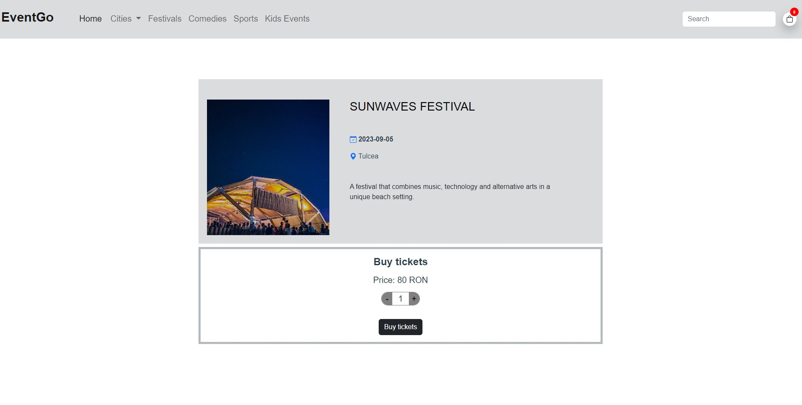
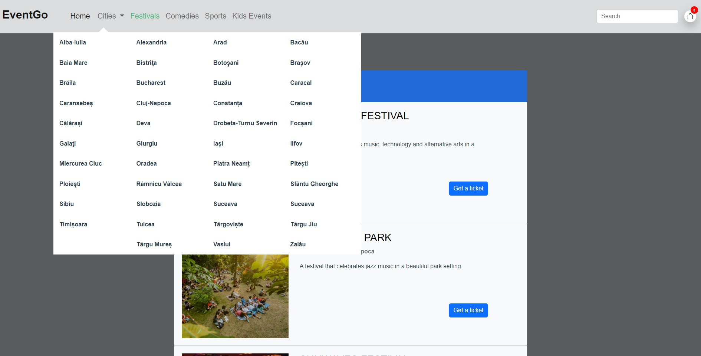

# EventsApp

The events app is designed to enhance your event-going experience. Users can easily search for events based on their
interests and location. They can select the event they are interested in attending and securely purchase tickets with
just a few clicks.

## Features

- view all events
- view events by category
- view events by location
- view an event details
- search event
- add event to cart
- delete event from cart
- view cart and proceeded to checkout
- make a payment
- place an order

## Built with

<p align="left"> <a href="https://vuejs.org/" target="_blank" rel="noreferrer">  </a>  <a href="https://getbootstrap.com" target="_blank" rel="noreferrer">  </a>  <a href="https://git-scm.com/" target="_blank" rel="noreferrer">  </a> <a href="https://developer.mozilla.org/en-US/docs/Web/JavaScript" target="_blank" rel="noreferrer">  </a>   <a href="https://www.w3schools.com/css/" target="_blank" rel="noreferrer">  </a> </p>

### Demo

https://eventgo-app.netlify.app/
 
### UI





## Project setup

```
npm install
```

### Compiles and hot-reloads for development

```
npm run serve
```

### Compiles and minifies for production

```
npm run build
```

### Lints and fixes files

```
npm run lint
```

### Customize configuration

See [Configuration Reference](https://cli.vuejs.org/config/).
